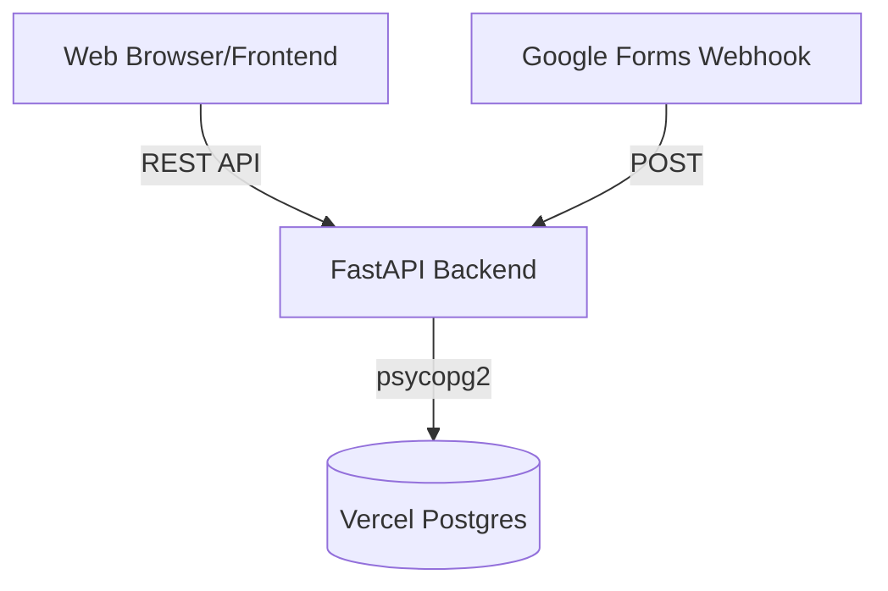

# 系統分析與架構設計 (SA) - 東寵戰情牆 (Management Dashboard)

## 1. 專案概述
**專案名稱**：東寵戰情牆 (Management Dashboard)
**系統定位**：提供即時的門市與區主管巡店數據總覽、活動紀錄追蹤以及資料管理，作為管理層的決策輔助平台。

## 2. 系統架構 (System Architecture)
本系統採用 **前後端分離 (Decoupled Architecture)** 架構。

- **前端 (Frontend)**：採用 React (TypeScript) 搭配 Vite 進行建置，使用 Tailwind CSS 進行樣式管理。
- **後端 (Backend)**：採用 Python (FastAPI) 建立 RESTful API，負責業務邏輯處理與資料庫互動。
- **資料庫 (Database)**：採用 Vercel Postgres (Neon) 作為關聯式資料庫，主要利用 PostgreSQL 的 JSONB 欄位提供靈活的儲存結構。
- **部署環境 (Deployment)**：支援 Vercel 部署，前端為靜態資源部署，後端作為 Serverless Functions 運行。

### 2.1 架構圖

## 3. 功能需求分析 (Functional Requirements)
1. **戰情總覽 (Dashboard Summary)**：支援依照特定日期（預設為當日）查詢巡店總數、異常數量、預期停留時間與亮點數量等核心指標。
2. **巡店動態 (Visit Activities)**：提供即時的巡店紀錄列表，支援依據時間區間（日、週、月）以及區域進行彈性過濾。
3. **主管資料管理 (Manager Management)**：提供主管資料（包含區主管、店經理等）的檢視，並支援批次匯入與更新。
4. **外部系統整合 (Webhook Integration)**：提供接收 Google Forms Webhook 的端點，自動將填寫內容轉換為系統內部的巡店紀錄格式。

## 4. 非功能需求 (Non-Functional Requirements)
- **效能與連線管理**：後端針對 Serverless 環境實作了 Connection Pool 機制（最小連線數 1，最大連線數 5），以避免瞬間高併發時耗盡資料庫連線。
- **資料擴展性**：系統刻意將 `visit_records` 與 `store` 資料表的細節欄位設計為 `JSONB` 格式，當未來增加表單欄位或業務需求時，不需頻繁執行資料庫的 Schema 變更 (Migration)。
